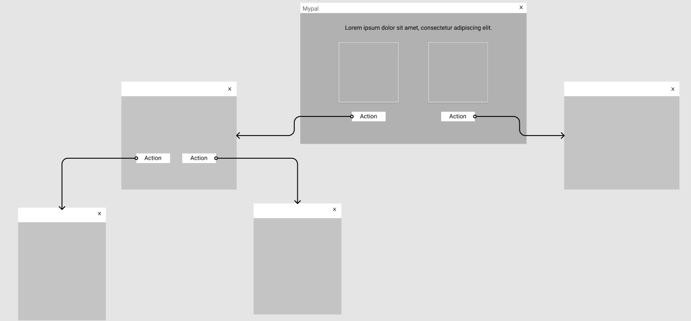
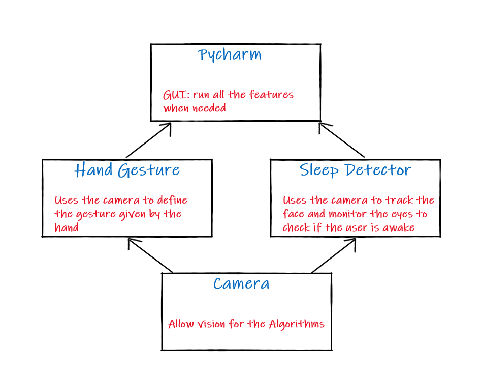

# MyPal
## Team Members:
- Jana Abdelkader
- Mohamad khalil
- Abdallah Alabed
- Abrar Alzubaidi
- Qamar Alkhatib
- Oqla Alrefai

## Project Description:

**This project aims to create a personal companion (my pal) were it will have multiple features and twists 
like alarm that only goes off by doing a simple math equation or do a specific hand gestures
another feature is to track the person while studying or working through eye tracking and a notify sound
will go off in case of sleeping to wake the person up.**

## WireFrame

## User Stories
1. General Use

User: As a user i want to have a simple, well layed-out app that is easy to use everyday.

US: so we used pycharm a simple and minimalist GUI that makes it easy to deal with our app!

2. Sleep Detector

User: As a user i want something to keep track of me and help me not fall asleep while studying,reading or working.

US: we have a sleep detection feature were we use your laptop camera to keep track of your eyes to ensure you are awake and will play a sound if the system detects you are asleep.

3. Smart Alarm

User: As a user i want something new and fun as i always fall asleep again after i turn off my alarm.

US: our alarm cant be turned off by a button, you must solve a math equation or do hand gestures to stop the alarm.

4. Technology Implementation

User: all alarms are getting boring and repetitve

US: we are creating a smart alarm that uses the cam to help you have a cooler alarm app!

## Software Requirements
1. Hand Gesture: hand gesture is a smart algorithm that tracks the hand in 21 points to detect the gesture given by the hand!

2. Face recognition: another awesome algorith that scans the face with the eyes to detect wether the user is focused and awake or asleep!

3. Pycharm: the housing for the code and other technologies as it creates a GUI (Graphical User Interface) and deploy all the technologies on it!

## Domain Modeling

